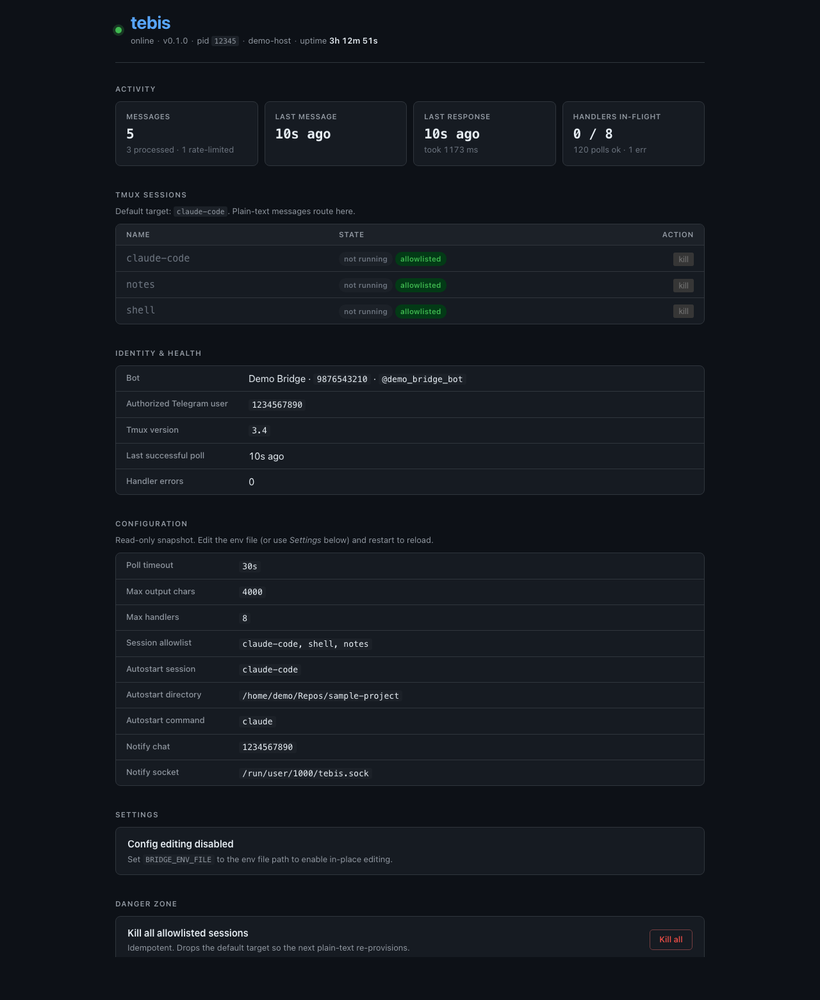

# tebis

[](LICENSE)
[](Cargo.toml)

A small, hardened Rust daemon that bridges **Telegram ↔ tmux** so you can
drive AI coding agents (Claude Code, Aider, …) or any long-running TUI
from your phone.

- Inbound: long-polls Telegram, sends your messages to a named tmux session.
- Outbound: reads pane output on request, forwards assistant replies via an
  opt-in Unix-domain socket the hook script writes to.
- Single statically-linked binary (~4 MB release), no web server, no cloud.



> **Security model — read first.** tebis is locked to **one** numeric
> Telegram user id and only forwards to a pre-declared (or regex-validated)
> set of session names. See [Security](#security).

## Quickstart

```sh
cargo build --release            # build the binary
./target/release/tebis setup     # interactive config wizard
./target/release/tebis           # run
```

The wizard walks through creating a bot on @BotFather, finding your
numeric user id, picking session names, and (optionally) autostart +
the control dashboard. It writes `~/.config/tebis/env` (mode 0600).

Then, to start it manually:

```sh
set -a; source ~/.config/tebis/env; set +a
./target/release/tebis
```

Or install as a persistent background service — see
[Run persistently](#run-persistently) below.

### Build from source

```sh
git clone https://github.com/<your-fork>/tebis.git
cd tebis
cargo build --release          # produces ./target/release/tebis
```

Requirements: Rust 1.95+ (edition 2024), `tmux` 3.x on the host.
Bot API traffic is HTTP/1.1 + rustls (ring); no OpenSSL, no native TLS.

## CLI

```
tebis              Run the bridge (reads env)
tebis setup        First-run wizard (creates ~/.config/tebis/env)
tebis --help       Env-var reference + options
tebis --version    Print version
```

## Configure

The setup wizard writes these; `tebis --help` lists them all. Full
reference:

| Variable | Required | Default | Notes |
|---|---|---|---|
| `TELEGRAM_BOT_TOKEN` | yes | — | From @BotFather |
| `TELEGRAM_ALLOWED_USER` | yes | — | Numeric user id (from @userinfobot) |
| `TELEGRAM_ALLOWED_SESSIONS` | no | — | Comma-separated allowlist. Unset = any valid tmux name is accepted. |
| `TELEGRAM_POLL_TIMEOUT` | no | `30` | Long-poll seconds (1..=900) |
| `TELEGRAM_MAX_OUTPUT_CHARS` | no | `4000` | `capture-pane` truncation cap |
| `TELEGRAM_AUTOSTART_SESSION` | no | — | Autostart session name (must be allowlisted) |
| `TELEGRAM_AUTOSTART_DIR` | no | — | Autostart working directory |
| `TELEGRAM_AUTOSTART_COMMAND` | no | — | Autostart command (e.g. `claude`) |
| `NOTIFY_CHAT_ID` | no | — | Enables outbound-notify listener |
| `NOTIFY_SOCKET_PATH` | no | `$XDG_RUNTIME_DIR/tebis.sock` or `/tmp/tebis-$USER.sock` | UDS path for hook pushes |
| `INSPECT_PORT` | no | — | Local HTML control dashboard on `127.0.0.1:<port>` |
| `BRIDGE_ENV_FILE` | no | — | Env file path (enables in-dashboard Settings edits) |

Session names must match `[A-Za-z0-9._-]{1,64}`. Invalid names fail startup.

## Run persistently

### macOS (launchd user agent)
```sh
cargo build --release
./contrib/macos/install.sh       # first run creates env file from template
# (edit ~/.config/tebis/env; or run `tebis setup`)
./contrib/macos/install.sh       # second run loads the agent
tail -f /tmp/tebis.log
```

Auto-starts at login (`RunAtLoad`), respawns on crash (`KeepAlive`).
Dashboard's **Restart bridge** button works because the plist sets
`KeepAlive=true` (matches systemd's `Restart=always`).

### Linux (systemd user unit)
```sh
cp target/release/tebis ~/.local/bin/
mkdir -p ~/.config/tebis ~/.config/systemd/user
./target/release/tebis setup     # or copy .env.example and edit manually
cp contrib/linux/tebis.service ~/.config/systemd/user/
systemctl --user daemon-reload
systemctl --user enable --now tebis
loginctl enable-linger "$USER"   # survive logout
```

Audit the sandbox: `systemd-analyze --user security tebis`.

## Commands

| Command | Effect |
|---|---|
| `/list` | List active tmux sessions (`✓` = allowlisted, `✗` = visible but not targetable) |
| `/status` | Show default target, autostart session, allowlist, uptime |
| `/send <session> <text>` | Send text + Enter to session |
| `/read [session] [lines]` | Capture pane output (default: current target, 50 lines) |
| `/target <session>` | Set the default target session |
| `/new <session>` | Create an empty detached tmux session |
| `/kill <session>` | Kill a tmux session (idempotent — already gone = OK) |
| `/restart` | Kill the autostart session and drop the cached target; next plain-text re-provisions |
| `/help` | Show help |
| *plain text* | Send to the default target (or autostart on first message) |

Ack-only commands react with 👍 instead of replying. Commands with output
(`/list`, `/read`, `/status`, `/help`) reply with a formatted `<pre>` block.
All text-returning paths are HTML-escaped before `parse_mode=HTML`.

## Autostart

Set all three of these to have the first plain-text message auto-provision
a detached tmux session running a TUI (e.g. `claude`):

```
TELEGRAM_AUTOSTART_SESSION=claude-code    # must be in TELEGRAM_ALLOWED_SESSIONS
TELEGRAM_AUTOSTART_DIR=/path/to/your/project
TELEGRAM_AUTOSTART_COMMAND=claude
```

Once configured, autostart-related behaviors:

- First plain-text message → provisions the session, waits 3 s for the TUI
  to boot, sends the message.
- If the autostart session later exits (Claude quit, pane died) and you
  send another plain-text message, the bridge clears the stale target,
  re-provisions, and retries once — so transient agent death self-heals.
- `/restart` gives you explicit control: kills the session + clears the
  target without sending anything.
- The directory is validated at config load; a bad `TELEGRAM_AUTOSTART_DIR`
  fails startup with a clear error instead of a confusing first-message tmux
  error.

## Claude Code notifications

The bridge can forward four kinds of Claude Code events to Telegram over a
local Unix-domain socket (mode 0600, unreachable from the network):

| Hook event | What gets sent | Header tag |
|---|---|---|
| `Stop` | tail of Claude's final message for the turn | *(none)* |
| `SubagentStop` | subagent's final message (pre-extracted by Claude Code) | `[agent]` |
| `Notification` / `permission_prompt` | "Claude needs permission to …" | `[ask]` |
| `Notification` / `idle_prompt` | "Claude is idle waiting for input" | `[idle]` |

### Summarization strategy

Rather than truncate the start of a long reply (losing the conclusion),
the hook takes two complementary steps:

1. **`UserPromptSubmit`** injects an `additionalContext` instruction asking
   Claude to end non-trivial replies with a concise ≤1500-char summary.
2. **`Stop`** / **`SubagentStop`** take the **tail** of the final assistant
   message (last 1500 chars, not first). If Claude complied with step 1,
   the tail is the summary. If it didn't, the tail still has the
   conclusion, which is usually what a phone notification wants.

No extra LLM calls, no Stop-block loops (both of which have documented
failure modes in the wild).

### Setup

1. Set these in the bridge's env:
   ```sh
   NOTIFY_CHAT_ID=<your-numeric-user-id>   # usually same as TELEGRAM_ALLOWED_USER
   ```
   The socket binds automatically at `$XDG_RUNTIME_DIR/tebis.sock`
   (or `/tmp/tebis-$USER.sock` as fallback).

2. In each project you want notifications for:
   ```sh
   mkdir -p .claude
   cp /path/to/tebis/contrib/claude/claude-settings.example.json .claude/settings.json
   # Edit /path/to/tebis in the `command` fields to point at your tebis checkout,
   # or merge the `hooks` entries into an existing settings.json.
   ```

3. Ensure `jq` and `nc` (BSD netcat — `netcat-openbsd` on Linux) are installed.

Remove any of the four hook blocks from `settings.json` to opt out of that
event type. The hook exits 0 on every path so it can never block Claude.

## Inspect dashboard

Set `INSPECT_PORT=51624` (or any port you like — the setup wizard defaults to
`51624` in the IANA dynamic range to avoid common collisions like Prometheus'
`9090`) and the bridge binds a local HTML control panel at
`http://127.0.0.1:51624/`. **Loopback-only**; no authentication — do not try to
expose it beyond the host.

What it shows:
- Non-secret config (allowed user id, session allowlist, autostart config, notify socket)
- Live tmux sessions with `✓`/`✗` markers, plus allowlisted-but-not-running
- Activity metrics: last message received, last response time + duration, total counts, poll success/errors, in-flight handlers
- Uptime, default target, handler slot availability

What you can do:
- `[Kill all allowlisted tmux sessions]` button — CSRF-protected POST that kills every session in the allowlist (idempotent), clears the default target so the next plain-text re-provisions.

`GET /status` returns the same info as JSON — pipe it to `jq`, hook it into your own observability, etc.

The page auto-refreshes every 5 seconds via `<meta http-equiv="refresh">`. Zero JavaScript, zero bundler, no external assets — it's a single server-rendered HTML page from `src/inspect.rs`.

## Security

tebis ships with sharp edges — it executes keystrokes into another process —
so the security model is worth understanding before you deploy it.

- **Auth by numeric Telegram `user.id` only.** Usernames are recyclable and
  never used for access control.
- **Session-name regex `[A-Za-z0-9._-]{1,64}` is enforced at every tmux
  call** (shell-metachar / path-traversal defense). Optional strict allowlist
  on top for defense in depth.
- **`send-keys -l` + separate `-H 0d`** so message text is sent as literal
  keystrokes and can never be interpreted as a tmux key-name.
- **All Telegram replies are HTML-escaped** before `parse_mode=HTML`. Output
  from tmux also passes through ANSI / C0 / C1 / bidi-codepoint stripping.
- **Bot token is held in `SecretString`**, never logged. Network errors walk
  the source chain and redact anything that looks like URL / token data.
- **Outbound-notify is UDS-only**, mode 0600 with `peer_cred` check on every
  accepted connection; not reachable from the network.
- **Per-chat GCRA rate limit + global handler semaphore** bound subprocess
  fan-out during bursts.
- **Reproducible dependency policy** in `deny.toml`: no OpenSSL, no native
  TLS, no `reqwest`, no `aws-lc-rs`. Allowed licenses are enumerated.

Reporting a vulnerability: see [SECURITY.md](SECURITY.md).

## Development

```sh
cargo test                                           # unit tests
cargo clippy --all-targets -- -D warnings            # base lints
cargo clippy --all-targets -- -D warnings \
    -W clippy::pedantic -W clippy::nursery           # full lints
cargo fmt --check                                    # style
cargo audit                                          # requires cargo-install cargo-audit
cargo deny check                                     # requires cargo-install cargo-deny
cargo build --release                                # ~4 MB binary (LTO + strip)
```

HTTP stack: `hyper` 1.x + `hyper-util` legacy `Client` + `hyper-rustls` +
`rustls` with the **ring** crypto backend and `webpki-roots` for CAs.
No `reqwest`, no `aws-lc-rs`, no native TLS. These are explicitly banned in
`deny.toml` to catch silent regressions.

See `CLAUDE.md` for invariants before changing security-sensitive code, and
[CONTRIBUTING.md](CONTRIBUTING.md) for PR expectations.

## Project layout

```
src/
  main.rs        poll loop, signals, runtime wiring
  bridge.rs      per-message behavior (rate-limit → parse → execute → reply)
  handler.rs     command parser + executor (/list, /send, /read, plain-text, …)
  session.rs     default-target state + autostart provisioning
  telegram.rs    hyper+rustls Bot API client with token redaction
  tmux.rs        send-keys / capture-pane / kill-session wrapper with name allowlist
  security.rs    user-id auth + GCRA rate limiter
  sanitize.rs    input/output sanitizers (C0/C1/bidi + HTML escape)
  config.rs      env-var parsing + validation
  metrics.rs     lock-free atomic counters
  setup.rs       `tebis setup` wizard
  inspect/       opt-in local HTML control dashboard
  notify/        opt-in UDS listener + Forwarder trait
  types.rs       Telegram DTOs
contrib/
  macos/         launchd user agent + installer
  linux/         systemd user unit (sandboxed)
  claude/        Claude Code hook script + example settings.json
examples/
  inspect-demo.rs   spin up the dashboard with synthetic metrics
```

## License

MIT — see [LICENSE](LICENSE).
