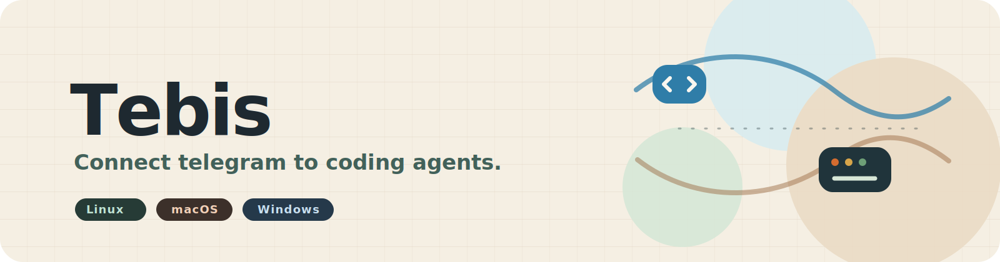

<div align="center">



# tebis

**Control local terminal agents from Telegram.**

Tebis is a small Rust daemon that connects a private Telegram bot to local
terminal sessions. Send prompts, voice notes, and slash commands from your
phone; Tebis types into `tmux`/`psmux`, reads back useful output, and can send
voice replies.

[](LICENSE)
[](Cargo.toml)
[](Cargo.toml)
[](#requirements)

**Supported:** Linux, macOS, and Windows.

</div>

## Requirements

| Platform | You need |
| --- | --- |
| macOS | Rust 1.95+, `tmux` 3.x, Xcode Command Line Tools |
| Linux | Rust 1.95+, `tmux` 3.x, C++ build tools, CMake |
| Windows | Rust 1.95+, [psmux][psmux], Visual Studio Build Tools with C++, CMake |

Works with Claude Code, Copilot CLI, aider, shells, or any terminal app that
accepts keyboard input. Voice features may download local speech models during
setup.

## Quick start

```sh
git clone https://github.com/johnkozaris/tebis.git
cd tebis
cargo build --release
./target/release/tebis setup
```

Windows PowerShell:

```powershell
git clone https://github.com/johnkozaris/tebis.git
cd tebis
cargo build --release
.\target\release\tebis.exe setup
```

The setup wizard walks you through:

- creating a Telegram bot with [`@BotFather`][botfather]
- finding your numeric Telegram ID with [`@userinfobot`][userinfobot]
- choosing which terminal sessions Tebis may control
- choosing a default project and agent command, such as `claude`
- optionally enabling faster replies, voice features, and the local dashboard

At the end, choose foreground mode for a quick test or background mode so Tebis
starts when you log in.

See [Setup guide](docs/setup.md) for platform notes and background service
commands.

## Use it from Telegram

Plain text goes to your current terminal session. Voice notes can be
transcribed and sent the same way when voice is enabled. Slash commands control
Tebis:

| Command | What it does |
| --- | --- |
| `/list` | Lists running terminal sessions |
| `/status` | Shows the current target and uptime |
| `/send <session> <text>` | Sends text to a specific session |
| `/read [session] [lines]` | Reads recent output |
| `/target <session>` | Makes a session the default target |
| `/new <session>` | Creates an empty background session |
| `/kill <session>` | Stops a session |
| `/restart` | Restarts the default agent on the next message |
| `/tts ...` | Changes voice replies |
| `/help` | Shows the Telegram command list |

Short control commands respond with a thumbs-up reaction instead of adding
noise to the chat.

## See what is going on

Enable the local dashboard to check service state, running sessions, recent
activity, hooks, and voice settings from the same machine.


See [Dashboard](docs/dashboard.md) for setup.

## More guides

| Guide | When to read it |
| --- | --- |
| [Setup](docs/setup.md) | Install, run, and manage Tebis as a background service |
| [Configuration](docs/configuration.md) | Edit the env file by hand |
| [Agent hooks](docs/hooks.md) | Get faster replies from Claude Code or Copilot CLI |
| [Voice](docs/voice.md) | Use Telegram voice notes and voice replies |
| [Dashboard](docs/dashboard.md) | Enable the local browser dashboard |
| [Contributing](CONTRIBUTING.md) | Open issues and pull requests |
| [Security policy](SECURITY.md) | Report vulnerabilities privately |

## License

MIT. See [LICENSE](LICENSE).

[botfather]: https://t.me/BotFather
[userinfobot]: https://t.me/userinfobot
[psmux]: https://github.com/psmux/psmux
